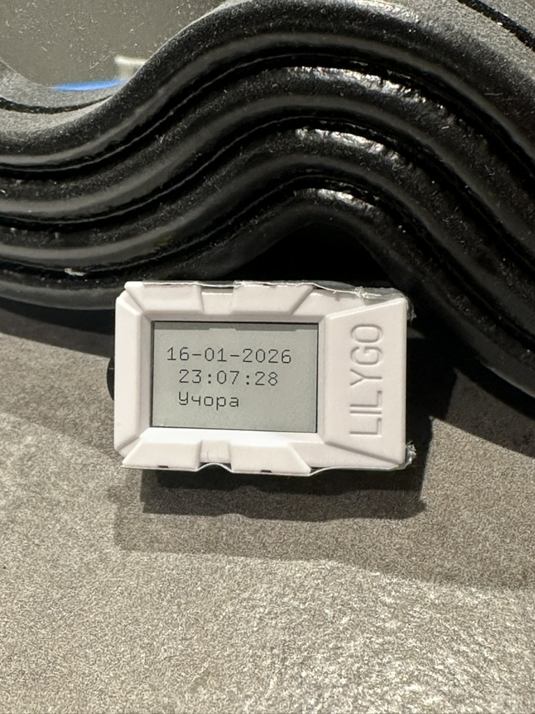
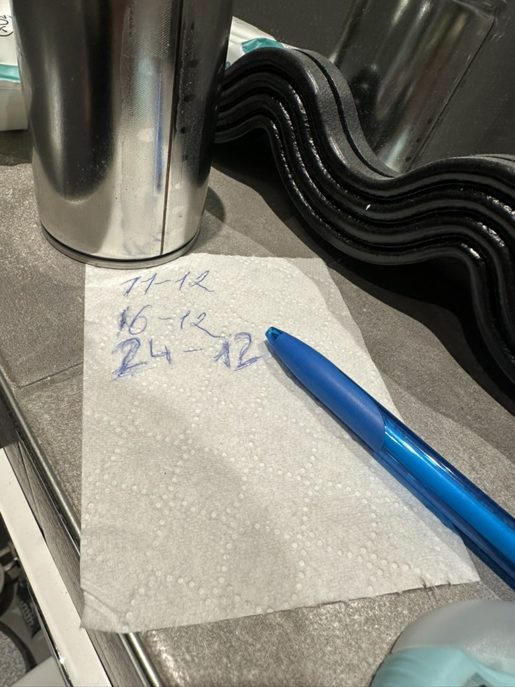

| Supported Targets | ESP32-S3 |
| ----------------- | -------- |

# Toilet Timer

A battery-powered cat litter box change tracker built on the LilyGo Mini E-Paper S3.



## Why?



We completely change the cat's litter box about once a week (with regular cleaning in between). The problem was we could never remember when the last change was. We used to write the date on toilet paper with a pen, but then you'd have to check your phone to figure out how many days ago that was.

This device shows the last change date and updates at midnight to display how many days have passed ("Today", "Yesterday", "2 days ago", etc.). Press the button to reset the date to today and the counter back to "Today".

There's no power outlet in the bathroom, so it needed to be battery-powered. Hence the e-ink display + deep sleep combination.

## Features

- E-paper display (80x128 resolution) - retains image with zero power
- Deep sleep mode for long battery life
- Single button to mark litter change
- SNTP time sync over Wi-Fi (connects only when needed)
- OTA firmware updates
- Shows days elapsed since last change in Ukrainian

## Hardware Required

* [LilyGo Mini E-Paper S3](https://github.com/Xinyuan-LilyGO/LilyGO-Mini-Epaper) development board
  - ESP32-S3 microcontroller
  - 1.02" e-paper display (80x128 pixels)
  - Built-in USB-C for programming and power
* USB-C cable

## Project Structure

```
toilet-timer/
├── main/
│   ├── main.c           # Main application logic
│   ├── epd_driver.c     # E-paper display driver implementation
│   ├── epd_driver.h     # E-paper display driver header
│   └── CMakeLists.txt   # Component build configuration
├── README.md
└── CMakeLists.txt       # Project build configuration
```

## Setup and Build

### 1. Install ESP-IDF

Follow the [ESP-IDF Getting Started Guide](https://docs.espressif.com/projects/esp-idf/en/latest/esp32s3/get-started/index.html) to install the ESP-IDF development framework.

### 2. Set the Target Chip

```bash
idf.py set-target esp32s3
```

### 3. Build the Project

```bash
idf.py build
```

### 4. Flash and Monitor

Connect your LilyGo Mini E-Paper S3 board via USB-C and run:

```bash
idf.py flash monitor
```

To exit the serial monitor, press `Ctrl+]`.

## Pin Configuration (LilyGo Mini E-Paper S3)

| Function | GPIO | Description |
|----------|------|-------------|
| MOSI     | 15   | SPI data out |
| CLK      | 14   | SPI clock |
| CS       | 13   | Chip select |
| DC       | 12   | Data/Command |
| RST      | 11   | Reset |
| BUSY     | 10   | Busy status |
| POWER    | 42   | Power enable (needed while powering from the battery) |

## Local OTA Update

1. Generate a certificate for the OTA Updates. Please **don't forget to fill the server name** on this step:

   **Common Name (e.g. server FQDN or YOUR name) []: 192.168.50.111** (your local IP address).

   `openssl req -newkey rsa:2048 -new -nodes -x509 -days 365 -keyout local_ota_server/key.pem -out main/ota_update/cert.pem -subj "/CN=192.168.50.111"`

2. Create new GIT Tag

   `git tag -a v0.0.1 -m "new release"`

   `git push origin v0.0.1` (optional)

3. Run OTA web-server from `local_ota_server` folder. I'm using this [http-server](https://github.com/http-party/http-server) as **OpenSSL one didn't work properly** and was hanging during download until you don't stop it manually.

   `cd local_ota_server`

   `sudo npx http-server -S -C ../main/ota_update/cert.pem -p 8070 -c-1`

4. Build the project. If the build is successful, the `dongle.bin` file will appear in the `local_ota_server` folder.

## Resources

- [ESP-IDF Documentation](https://docs.espressif.com/projects/esp-idf/en/latest/esp32s3/)
- [LilyGo GitHub](https://github.com/Xinyuan-LilyGO/LilyGO-Mini-Epaper)
- [Proper PIN map from Smoria](https://github.com/Xinyuan-LilyGO/LilyGO-Mini-Epaper/issues/7)